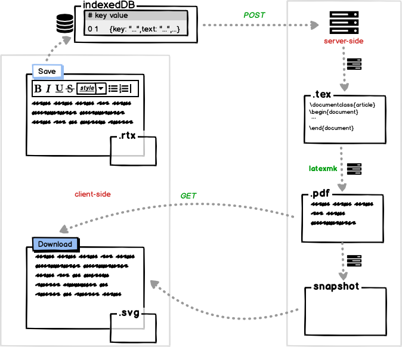

# README
打算开发一个富文本编辑器 Eorg（暂时就这样称呼吧），查了一下 Wikipedia，用 `contenteditable` 的比较多，但是 MDN 指出 `.execCommand`
已经过时了，所以就选了 Draftjs 框架实现

# References:

## Create React App

This project was bootstrapped with [Create React App](https://github.com/facebook/create-react-app).

## 1st commit: 

[Create A Minimal Rich Text Editor Using React and Draft.js -- Quick and Easy](https://youtu.be/XGxdCXyMC7k)

## 3rd commit:

[React refs](https://reactjs.org/docs/refs-and-the-dom.html)

## 5th commit:

[Trying to use getCurrentContent in draftjs file
](https://stackoverflow.com/a/40778883/8537000)

[properly initializing an IndexedDB object store
](https://stackoverflow.com/a/28013371/8537000)

## 8th commit:

[build-a-basic-web-app-with-indexedDB](https://dev.to/andyhaskell/build-a-basic-web-app-with-indexeddb-38ef)